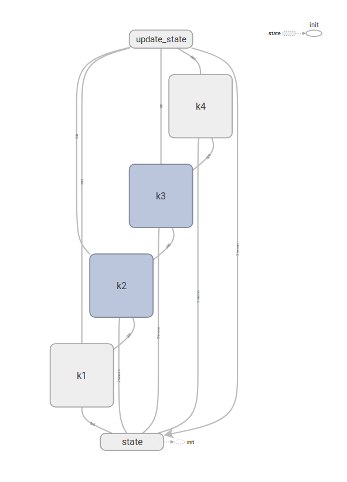

This code uses the automatic differentiation capabilities of TensorFlow to generate equations of motion.  Below is a simulation of a vibrating string generated using the code.  The string is modeled as 100 masses connected linearly by springs.

   <video  style="display:block; width:100%; height:auto;" autoplay controls loop="loop">
       <source src="im.mp4" type="video/mp4" />
   </video>

Below is a visualization of the TensorFlow graph.  You can see the four boxes responsible for calculating the four k values of RK4 and how they are then combined into the update_state box.

